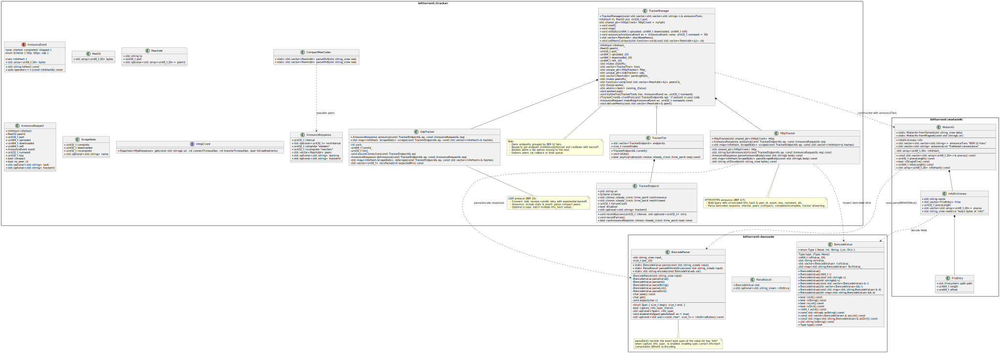

# BitTorrent Tracker Subsystem

This repository contains a **C++20 implementation of a BitTorrent tracker subsystem**, including:

- **Bencode parser/encoder** (`bittorrent::bencode`)
- **Metainfo parser** for `.torrent` and magnet links (`bittorrent::metainfo`)
- **Tracker clients** (`bittorrent::tracker`):
  - HTTP(S) tracker client (BEP 3/7)
  - UDP tracker client (BEP 15)
- **TrackerManager** for coordinating multiple tracker tiers, scheduling announces, and draining peers.

The implementation is modular and covered by unit tests using **Catch2 v3**.

## UML Design:


## Features

- Parse `.torrent` files and magnet URIs.
- Compute spec-correct **info-hash** (SHA-1 over exact "info" slice).
- Encode/decode bencoded values.
- Handle **announce** and **scrape** requests:
  - HTTP/HTTPS trackers via libcurl
  - UDP trackers via raw sockets
- Support **BEP 12 tracker tiers** (list-of-lists).
- Expose peers to client code via callbacks or `drainNewPeers()`.
- Unit test coverage for:
  - `BencodeValue` / `BencodeParser`
  - `Metainfo`
  - `CompactPeerCodec`
  - `TrackerEndpoint` / `TrackerTier`
  - `HttpTracker`
  - `TrackerManager`


## Repository Structure

```

include/bittorrent/
├── bencode/            # Bencode parser/encoder
│   ├── bencode.hpp
│   └── bencode.cpp
│   └── tests/
├── metainfo/           # .torrent parsing
│   ├── metainfo.hpp
│   └── metainfo.cpp
│   └── tests/
└── tracker/            # Tracker subsystem
├── include/        # Public tracker headers
│   ├── types.hpp
│   ├── endpoint.hpp
│   ├── http_tracker.hpp
│   ├── udp_tracker.hpp
│   ├── manager.hpp
│   └── http_client.hpp
│   └── compact_peer_codec.hpp
│   └── iclient.hpp
│   └── expected.hpp
├── src/            # Tracker implementation
│   ├── types.cpp
│   ├── compact_peer.cpp
│   ├── endpoint.cpp
│   ├── http_tracker.cpp
│   ├── http_client_curl.cpp
│   └── manager.cpp
└── tests/          # Unit tests + demo
├── test_types.cpp
├── test_compact_peer.cpp
├── test_endpoint.cpp
├── test_http_tracker.cpp
├── test_tracker_manager.cpp
├── demo_tracker.cpp        # Demo executable
└── sample.torrent

````

---

## Dependencies

- **C++20 compiler** (tested with GCC 14 / Clang 17)
- **CMake ≥ 3.16**
- **Catch2 v3** (system-installed)
- **libcurl** (for HTTP/HTTPS tracker client)

On Ubuntu/Debian:

```bash
sudo apt update
sudo apt install build-essential cmake libcurl4-openssl-dev catch2
````

---

## Build & Test

```bash
cd bittorrent/tracker/tests
sudo chmod +x run_tests.sh
./run_tests.sh   #builds and runs all tests
```

### Available Tests

* `test_types`
* `test_compact_peer`
* `test_endpoint`
* `test_http_tracker`
* `test_tracker_manager`

Run a single test:

```bash
./build/test_http_tracker
```


## Demo: Running a Tracker Announce

A small demo program `demo_tracker.cpp` is included. It loads a `.torrent` file, extracts announce tiers, and performs tracker announces:

```bash
./build/demo_tracker ../archive_1.torrent (or any other torrent file to test can be placed in tests dir)
```

Example output:

```
=== Running demo_tracker ===
Announce list:
  Tier 0:
    http://bittorrent-test-tracker.codecrafters.io/announce
Peers:
  165.232.35.114:51444
  165.232.38.164:51433
  165.232.41.73:51544
  165.232.35.114:51444
  165.232.38.164:51433
  165.232.41.73:51544
```

Note: Peers listed are raw IP\:port endpoints discovered from public trackers. No peer connections are established by this demo.

---

## Next Steps

* [ ] Extend TrackerManager scheduling: exponential backoff, jitter.
* [ ] Implement full UDP tracker support (connect + announce + scrape).
* [ ] Wire into `TorrentSession` for peer management.
* [ ] Add integration tests with real trackers.

---

